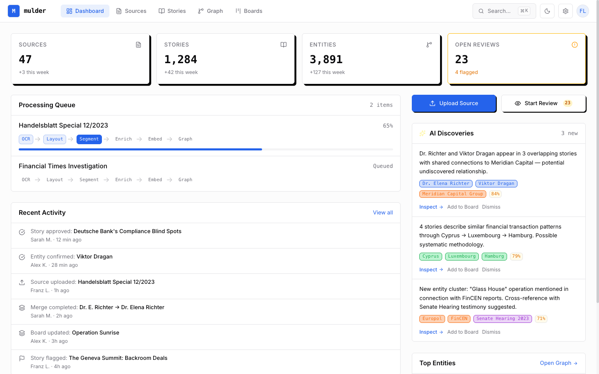

<p align="center">
  
</p>

<h1 align="center">Mulder</h1>

<p align="center">
  <strong>Config-driven Document Intelligence Platform on GCP</strong><br />
  Turn document collections into searchable knowledge graphs — defined by one config file, deployed by one command.
</p>

<p align="center">
  <em>The truth is in the documents.</em>
</p>

<p align="center">
  <a href="https://mulder.mulkatz.dev"></a>
  <a href="./LICENSE"></a>
  
  
  
</p>

<p align="center">
  <a href="https://mulder.mulkatz.dev">Live Demo</a> &middot;
  <a href="./docs/functional-spec.md">Functional Spec</a> &middot;
  <a href="./docs/roadmap.md">Roadmap</a> &middot;
  <a href="./mulder.config.example.yaml">Example Config</a>
</p>

---

<!-- PROGRESS:START — auto-updated by auto-pilot -->
<table align="center">
<tr><td>

**Development Progress** &ensp; `26 / 81 steps`

```
M1 Foundation       ██████████████████████████████ 11/11 ✓
M2 Ingest+Extract   ██████████████████████████████  9/9  ✓
M3 Segment+Enrich   ██████████████████░░░░░░░░░░░  6/10
M4 Search (v1.0)    ░░░░░░░░░░░░░░░░░░░░░░░░░░░░░  0/11
M5 Curation         ░░░░░░░░░░░░░░░░░░░░░░░░░░░░░  0/5
M6 Intelligence     ░░░░░░░░░░░░░░░░░░░░░░░░░░░░░  0/7
M7 API+Workers      ░░░░░░░░░░░░░░░░░░░░░░░░░░░░░  0/9
M8 Operations       ░░░░░░░░░░░░░░░░░░░░░░░░░░░░░  0/6
M9 Multi-Format     ░░░░░░░░░░░░░░░░░░░░░░░░░░░░░  0/13
```

</td></tr>
</table>
<!-- PROGRESS:END -->

<p align="center">
  
</p>

## What it does

Mulder transforms unstructured document collections — PDFs with complex layouts like magazines, newspapers, government correspondence — into structured, searchable knowledge.

You define your domain ontology in a single `mulder.config.yaml`. The pipeline adapts: extraction, entity resolution, retrieval, and analysis all derive from that one config file. No custom code per domain.

```
mulder.config.yaml  →  terraform apply  →  mulder pipeline run ./pdfs/  →  mulder query "..."
```

## Capabilities

| # | Capability | What it does |
|---|-----------|-------------|
| 1 | **Layout Extraction** | Document AI + Gemini Vision fallback for magazines, newspapers, multi-column layouts |
| 2 | **Domain Ontology** | One YAML defines entities, relationships, extraction rules. Gemini structured output with auto-generated JSON Schema. |
| 3 | **Taxonomy** | Auto-bootstrapped after ~25 docs, incremental growth, human-in-the-loop curation, cross-lingual |
| 4 | **Hybrid Retrieval** | Vector (pgvector) + BM25 (tsvector) + graph traversal (recursive CTEs), fused via RRF + LLM re-ranking |
| 5 | **Web Grounding** | Gemini verifies entities against live web data — coordinates, bios, org descriptions |
| 6 | **Spatio-Temporal** | PostGIS proximity queries, temporal clustering, pattern detection across time and space |
| 7 | **Evidence Scoring** | Corroboration scores, two-phase contradiction detection, source reliability (PageRank), evidence chains |
| 8 | **Cross-Lingual Resolution** | 3-tier entity resolution (attribute match, embedding similarity, LLM-assisted) across 100+ languages |
| 9 | **Deduplication** | MinHash/SimHash near-duplicate detection, dedup-aware corroboration scoring |
| 10 | **Schema Evolution** | Config-hash tracking per document per step, selective reprocessing after config changes |
| 11 | **Visual Intelligence** | Image extraction, Gemini analysis, image embeddings, map/diagram data extraction |
| 12 | **Pattern Discovery** | Cluster anomalies, temporal spikes, subgraph similarity, proactive insights |

## Pipeline

```
          PDF
           │
     ┌─────▼─────┐
     │   Ingest  │  Upload to Cloud Storage, pre-flight validation
     └─────┬─────┘
           │
     ┌─────▼─────┐
     │  Extract  │  Document AI + Gemini Vision fallback → layout JSON + page images → GCS
     └─────┬─────┘
           │
     ┌─────▼─────┐
     │  Segment  │  Gemini identifies stories from page images → Markdown + metadata → GCS
     └─────┬─────┘
           │
     ┌─────▼─────┐
     │   Enrich  │  Entity extraction, taxonomy normalization, cross-lingual resolution
     └─────┬─────┘
           │
     ┌─────▼─────┐
     │   Ground  │  Web enrichment via Gemini Search — coordinates, bios, verification
     └─────┬─────┘
           │
     ┌─────▼─────┐
     │   Embed   │  Semantic chunking + text-embedding-004 (768-dim) → pgvector + BM25
     └─────┬─────┘
           │
     ┌─────▼─────┐
     │   Graph   │  Deduplication, corroboration scoring, contradiction flagging
     └─────┬─────┘
           │
     ┌─────▼─────┐
     │  Analyze  │  Contradiction resolution, PageRank reliability, evidence chains
     └─────┬─────┘
           │
       Knowledge
         Graph
```

Every step is idempotent, independently runnable, and CLI-accessible. Content artifacts live in GCS, search index in PostgreSQL.

## Configuration

All domain logic lives in `mulder.config.yaml`. Define your domain, the pipeline adapts:

```yaml
project:
  name: investigative-journalism

ontology:
  entity_types:
    - name: person
      description: Individual mentioned in documents
      attributes:
        - { name: role, type: string }
        - { name: affiliation, type: string }
    - name: event
      description: A specific incident or occurrence
      attributes:
        - { name: date, type: date }
        - { name: location, type: string }
    - name: location
      description: Geographic place
      attributes:
        - { name: coordinates, type: geo_point, optional: true }

  relationships:
    - { name: involved_in, from: person, to: event }
    - { name: occurred_at, from: event, to: location }
```

Everything beyond `project` and `ontology` has sensible defaults. See [`mulder.config.example.yaml`](./mulder.config.example.yaml) for the full reference.

## Architecture

<table>
<tr><td><strong>Single PostgreSQL</strong></td><td>pgvector + tsvector + PostGIS + recursive CTEs + job queue — one instance, no graph DB, no Redis, no Pub/Sub</td></tr>
<tr><td><strong>Content in GCS</strong></td><td>PDFs, layout JSON, page images, story Markdown in Cloud Storage. PostgreSQL holds references + search index only.</td></tr>
<tr><td><strong>Service Abstraction</strong></td><td>All GCP services behind interfaces. Dev mode uses fixtures — zero API calls, zero cost.</td></tr>
<tr><td><strong>CLI-first</strong></td><td>Every capability is a CLI command. The API is a job producer, not a direct executor.</td></tr>
<tr><td><strong>PostgreSQL is truth</strong></td><td>Pipeline state, job queue, config tracking. Firestore is observability-only (UI monitoring).</td></tr>
</table>

**Baseline cost:** ~30-40 EUR/mo for a small Cloud SQL instance. Scales with Gemini API usage.

## Tech Stack

| | |
|---|---|
| **Language** | TypeScript (ESM, strict mode) |
| **Monorepo** | pnpm + Turborepo |
| **Infrastructure** | Terraform (modular) |
| **OCR** | Document AI Layout Parser |
| **LLM** | Gemini 2.5 Flash (Vertex AI) |
| **Embeddings** | text-embedding-004 (768-dim Matryoshka) |
| **Database** | Cloud SQL PostgreSQL |
| **Search** | pgvector (HNSW) + tsvector (BM25) + recursive CTEs |
| **Geospatial** | PostGIS |
| **CLI** | Commander.js |
| **Testing** | Vitest |

## Status

Mulder's design phase is complete — [functional spec](./docs/functional-spec.md), [implementation roadmap](./docs/roadmap.md), and [config schema](./mulder.config.example.yaml) are finalized.

Currently building **Milestone 2** (ingest + extract: first GCP integration, Document AI, Cloud Storage).

See the [roadmap](./docs/roadmap.md) for all 9 milestones from foundation to multi-format ingestion.

## Contributing

Contributions, feedback, and ideas are welcome. Open an issue or start a discussion.

## License

[Apache 2.0](LICENSE)
